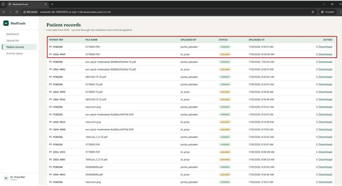

# MedVault – Secure Hospital Records File Management Platform


## Introduction

MedVault is a secure cloud-based Hospital Records File Management Platform developed using AWS Cloud and Linux Administration technologies.

The platform allows doctors to securely upload patient records, nurses to access authorized records, and IT administrators to manage the complete infrastructure.

The application follows a secure multi-tier AWS architecture designed to provide security, scalability, high availability, automation, and disaster recovery.

Patient records are securely uploaded using FTPS, validated using Linux Bash scripts, stored in Amazon S3, and their metadata is maintained in Amazon RDS MySQL. AWS Lambda and Amazon SNS provide automated processing and notifications, while Amazon CloudFront provides secure access to records using Signed URLs.

---

# Technologies Used

## AWS Services

- Amazon EC2
- Amazon VPC
- Internet Gateway
- NAT Gateway
- Bastion Host
- Application Load Balancer (ALB)
- Auto Scaling Group (ASG)
- Target Group
- Amazon S3
- Amazon CloudFront
- Amazon API Gateway
- AWS Lambda
- Amazon RDS MySQL
- Amazon SNS
- IAM
- Security Groups
- Amazon CloudWatch

## Linux & DevOps Technologies

- Amazon Linux 2023
- Nginx
- Node.js
- Express.js
- VSFTPD (FTPS)
- Bash Shell Scripting
- Cron Jobs
- Linux Users & Groups
- Linux ACL
- LVM
- LUKS Encryption
- MySQL

---

# AWS Architecture

## Complete Architecture

<p align="center">
  
</p>

The MedVault architecture uses a multi-tier AWS design with public and private subnets.

The architecture includes:

- Amazon VPC
- Public and Private Subnets
- Application Load Balancer
- Auto Scaling Group
- EC2 Instances
- Bastion Host
- NAT Gateway
- Amazon RDS MySQL
- Amazon S3
- Amazon EFS
- API Gateway
- AWS Lambda
- Amazon SNS
- Amazon CloudFront
- IAM
- Security Groups

The architecture separates public-facing components from application and database resources to improve security and maintainability.

---

# Project Workflow

The complete MedVault workflow is:

1. The doctor accesses the MedVault application.

2. The request reaches the Application Load Balancer.

3. The Application Load Balancer distributes traffic to the application servers.

4. The doctor logs in using authorized credentials.

5. The doctor uploads patient records securely using FTPS.

6. Validation scripts verify the uploaded files.

7. Validated records are processed by the application.

8. Patient files are stored securely in Amazon S3.

9. AWS Lambda processes the uploaded record.

10. Patient metadata and file information are stored in Amazon RDS MySQL.

11. Amazon SNS sends email notifications to authorized users.

12. CloudFront provides secure access to patient records using Signed URLs.

13. Old records are archived using Bash scripts and Cron Jobs.

14. Archive data is protected using LUKS encrypted storage.

15. Archive backups are synchronized with Amazon S3 for disaster recovery.

---

# Project Structure

```text
MedVault/
│
├── image/
│   ├── CDN.jpg
│   ├── RDSDATA.jpg
│   ├── S3SYNC.jpg
│   ├── arc.jpg
│   ├── dashboard.jpg
│   ├── fileuploads.jpg
│   ├── login.jpg
│   ├── snsmail.jpg
│   └── upload.jpg
│
├── public/
├── scripts/
├── sql/
├── src/
├── views/
├── tmp-uploads/
│
├── server.js
├── package.json
├── package-lock.json
├── README.md
└── .gitignore
```

---

# Login Page

Doctors, Nurses, and IT Administrators can securely log in to the MedVault platform using their authorized credentials.

<p align="center">
  
</p>

---

# Upload Patient Records

Doctors can upload patient records through the MedVault application.

Uploaded records are securely transferred using FTPS and validated before further processing.

<p align="center">
  
</p>

---

# Doctor Dashboard

The Doctor Dashboard allows doctors to upload patient records, manage uploaded files, and access authorized patient records.

Secure download links are provided through CloudFront Signed URLs.

<p align="center">
  
</p>

---

# Secure File Upload – FTPS

MedVault uses VSFTPD with FTP over TLS (FTPS) for secure file transfer.

FTPS protects patient records during transmission by encrypting the communication channel.

Validation scripts check uploaded files before they are stored in Amazon S3.

<p align="center">
  
</p>

---

# Amazon RDS MySQL

Amazon RDS for MySQL is used to store application and patient-record metadata.

The database stores information such as:

- User details
- Patient metadata
- File information
- Upload records
- Record references
- Application data

<p align="center">
  
</p>

---

# Amazon SNS Notification

When a doctor uploads a new patient record, the application workflow triggers AWS Lambda.

Lambda processes the event and Amazon SNS sends an email notification to the configured recipients.

<p align="center">
  
</p>

---

# Amazon CloudFront

Amazon CloudFront is used to securely deliver patient records.

CloudFront Signed URLs provide controlled access to protected files without exposing the S3 objects directly to unauthorized users.

CloudFront also improves download performance by delivering content through AWS edge locations.

<p align="center">
  
</p>

---

# Amazon S3 Synchronization

Amazon S3 is used as secure object storage for validated patient records.

Archive backups are also synchronized to Amazon S3 to support disaster recovery.

<p align="center">
  
</p>

---

# Archive Management

Old patient records are automatically archived using Linux Bash scripts and Cron Jobs.

Archive storage is protected using LUKS encryption.

The archived data can also be synchronized to Amazon S3 for backup and disaster recovery.

---

# Security Features

MedVault implements multiple layers of security.

### AWS Security

- Multi-tier VPC architecture
- Public and private subnets
- Bastion Host
- NAT Gateway
- Security Groups
- IAM Roles
- Private RDS deployment
- S3 access control
- CloudFront Signed URLs
- API Gateway
- AWS Lambda
- Encryption

### Linux Security

- Linux Users and Groups
- File Permissions
- Linux ACL
- LUKS Disk Encryption
- Secure FTPS
- Restricted SSH Access
- Nginx Configuration
- Systemd Services

---

# High Availability and Scalability

MedVault uses AWS services to improve application availability and scalability.

### Application Load Balancer

The ALB distributes incoming traffic across healthy application servers.

### Auto Scaling Group

The Auto Scaling Group can automatically launch or terminate EC2 instances based on configured scaling policies.

### Multi-AZ Architecture

Resources can be distributed across multiple Availability Zones to reduce dependency on a single Availability Zone.

### Amazon S3

S3 provides highly durable object storage for patient records and backups.

---

# Disaster Recovery

MedVault includes multiple mechanisms for protecting important records.

- Patient records stored in Amazon S3
- Archive backups synchronized to Amazon S3
- LUKS encrypted archive storage
- Amazon RDS automated backups
- Multi-AZ database deployment where required
- Secure backup storage
- Automated Bash and Cron Jobs

These mechanisms help protect patient records from accidental deletion, server failure, or storage failure.

---

# AWS Services Used

| AWS Service | Purpose |
|---|---|
| Amazon EC2 | Hosts application and supporting servers |
| Amazon VPC | Provides isolated network infrastructure |
| Internet Gateway | Provides internet connectivity for public resources |
| NAT Gateway | Provides outbound internet access for private resources |
| Application Load Balancer | Distributes application traffic |
| Auto Scaling Group | Provides scalability and high availability |
| Target Group | Registers and monitors application instances |
| Amazon S3 | Stores patient records and backups |
| Amazon CloudFront | Securely delivers patient records |
| API Gateway | Provides API management |
| AWS Lambda | Provides event-driven automation |
| Amazon RDS MySQL | Stores application and patient metadata |
| Amazon SNS | Sends email notifications |
| IAM | Controls AWS resource access |
| Security Groups | Controls network traffic |
| CloudWatch | Provides monitoring and logging |

---

# Linux Administration Features

The project demonstrates several Linux administration concepts.

- Linux User Management
- Linux Group Management
- File Permissions
- Linux ACL
- SSH Configuration
- Nginx
- VSFTPD
- FTPS
- LVM
- LUKS Encryption
- Bash Scripting
- Cron Jobs
- Systemd Services
- Disk Management
- Storage Management
- Service Management

---

# Key Features

- Secure Doctor Login
- Role-Based Access
- Secure Patient Record Upload
- FTPS File Transfer
- File Validation
- Amazon S3 Storage
- Amazon RDS MySQL Metadata Storage
- AWS Lambda Automation
- Amazon SNS Notifications
- CloudFront Secure Delivery
- Signed URLs
- Archive Management
- LUKS Encryption
- S3 Backup
- Disaster Recovery
- Application Load Balancer
- Auto Scaling
- Private Networking
- Linux Administration

---

# Project Benefits

MedVault demonstrates how AWS Cloud and Linux Administration technologies can be combined to build a secure hospital records management platform.

The architecture provides:

- Secure data transfer
- Secure storage
- Controlled access
- Automated processing
- Automated notifications
- Scalable application infrastructure
- High availability
- Disaster recovery
- Linux-based automation
- Encrypted archive storage

---

# Conclusion

The MedVault project demonstrates the implementation of a secure, scalable, and highly available Hospital Records File Management Platform using AWS Cloud and Linux technologies.

Doctors can securely upload patient records using FTPS. Uploaded files are validated before being stored in Amazon S3. Patient metadata is maintained in Amazon RDS MySQL, while AWS Lambda provides automated processing and Amazon SNS provides notification services.

Amazon CloudFront provides secure delivery of patient records using Signed URLs, while Linux technologies such as ACL, LVM, LUKS Encryption, Bash Scripting, Cron Jobs, Nginx, and VSFTPD improve system security and automation.

AWS services including Amazon EC2, VPC, Application Load Balancer, Auto Scaling Group, S3, CloudFront, API Gateway, Lambda, RDS, SNS, and IAM work together to provide a secure and reliable cloud architecture.

The project demonstrates practical knowledge of AWS Cloud, Linux Administration, networking, security, storage, automation, and disaster recovery.

---

# Developed By

## Tanuja T S

**AWS Cloud | Linux Administrator | DevOps Enthusiast**

---

⭐ **If you found this project useful, don't forget to Star the repository.**
