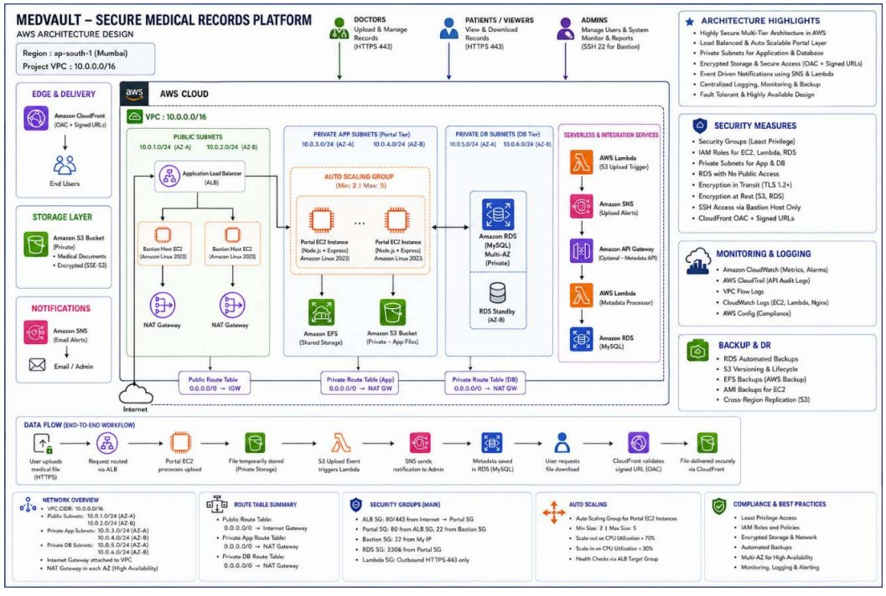
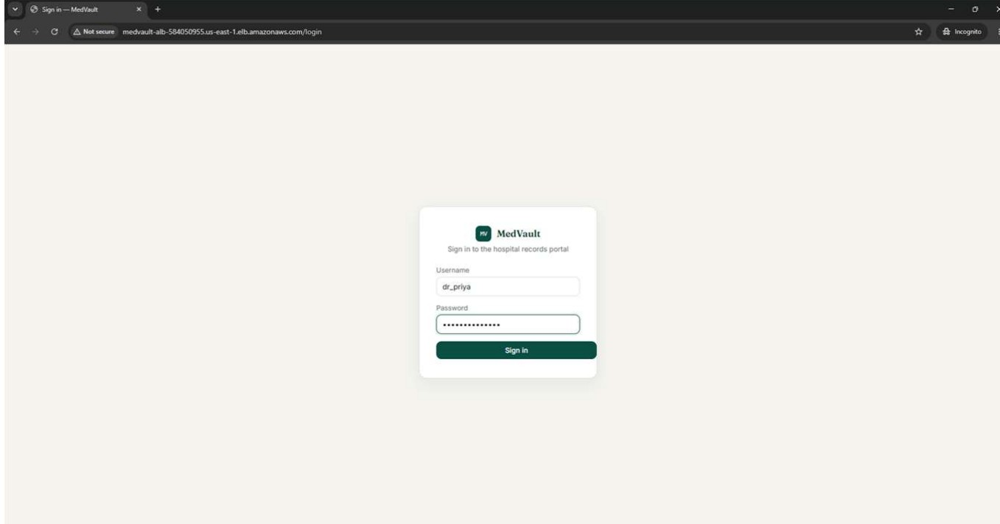
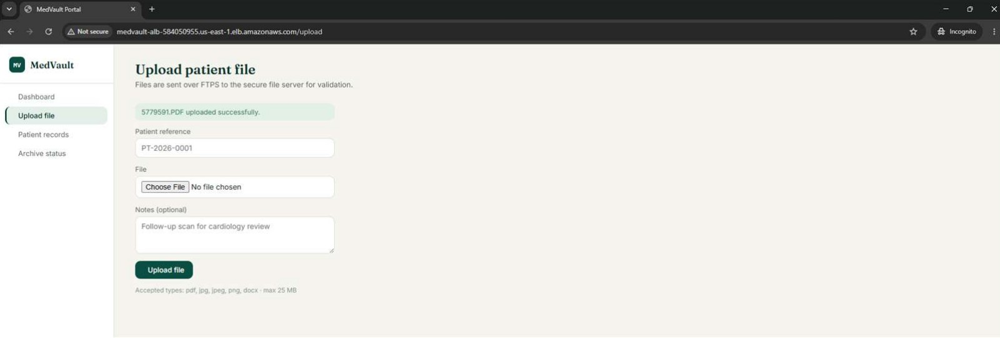
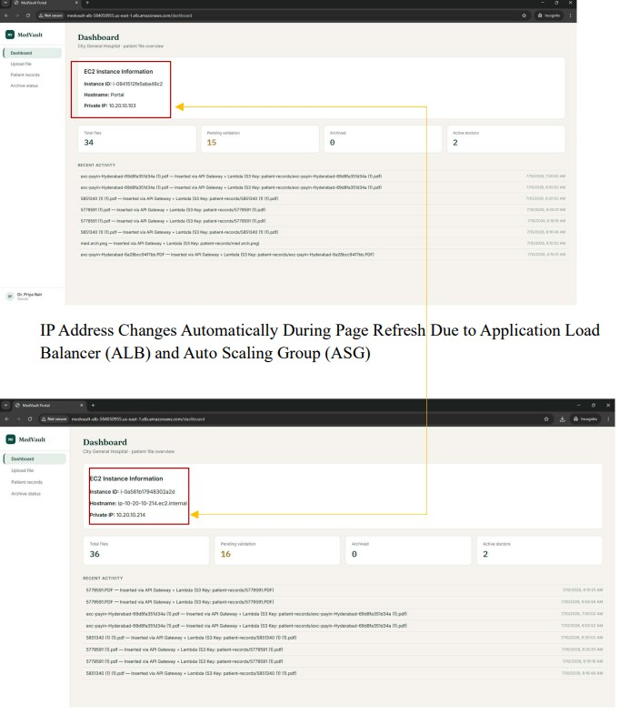
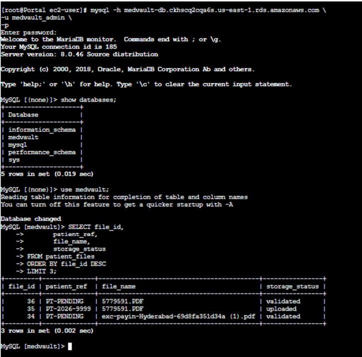
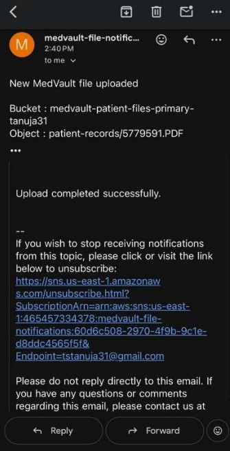
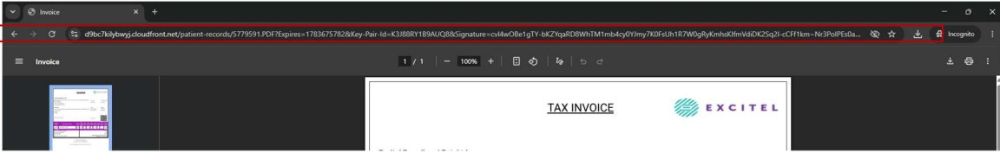
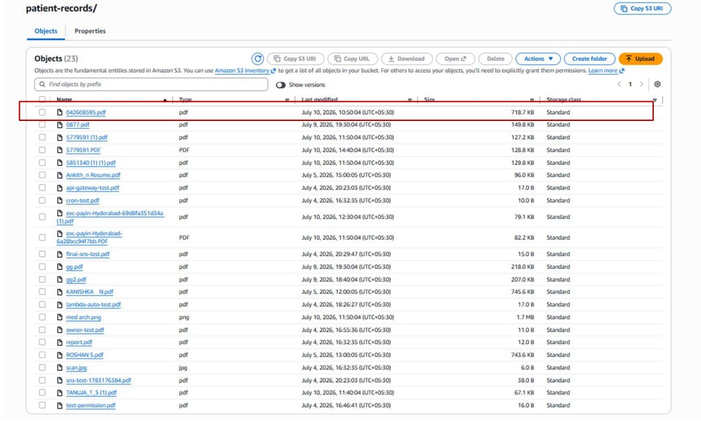

# MedVault – Secure Hospital Records File Management Platform

## Introduction

MedVault is a secure cloud-based Hospital Records File Management Platform developed using AWS and Linux technologies. The project allows doctors to securely upload patient records, nurses to access authorized records, and IT administrators to manage the complete infrastructure. The application follows a secure multi-tier architecture using AWS services and Linux administration concepts to provide high availability, scalability, automation, and data security. Patient records are securely uploaded through FTPS, stored in Amazon S3, metadata is maintained in Amazon RDS, notifications are sent using Amazon SNS, and records are securely delivered through Amazon CloudFront using Signed URLs.

---

# Technologies Used

- Amazon EC2
- Amazon VPC
- Internet Gateway
- NAT Gateway
- Application Load Balancer (ALB)
- Auto Scaling Group (ASG)
- Target Group
- Amazon S3
- Amazon CloudFront
- API Gateway
- AWS Lambda
- Amazon RDS MySQL
- Amazon SNS
- IAM
- Security Groups
- VSFTPD (FTPS)
- Linux Users & Groups
- Linux ACL
- LVM
- LUKS Encryption
- Bash Shell Scripting
- Cron Jobs
- Nginx
- Node.js
- Express.js
- MySQL

---

# AWS Architecture

> Add your Architecture Diagram here.

Example:

```md

```

---

# Project Workflow

1. Doctor accesses the MedVault application through the Application Load Balancer.

2. Login credentials are validated by the Node.js Portal Application.

3. Doctor uploads patient records securely using FTPS.

4. Validation scripts verify the uploaded files.

5. Valid records are stored in Amazon S3.

6. Lambda automatically processes the uploaded file.

7. SNS sends an email notification.

8. Patient metadata is stored in Amazon RDS.

9. CloudFront generates Signed URLs for secure download.

10. Archive Server securely stores old records and backs them up to Amazon S3.

---

# Project Structure

```
MedVault/
│
├── image/
├── public/
├── scripts/
├── sql/
├── src/
├── views/
├── server.js
├── package.json
├── package-lock.json
├── README.md
└── .gitignore
```

---

# Login Page

Doctors, Nurses, and IT Administrators securely log in using their authorized credentials.



---

# Upload Patient Records

Doctors securely upload patient records using FTPS. Validation scripts verify every uploaded file before processing.



---

# Doctor Dashboard

Doctors can upload patient records, view uploaded records, and securely download files using CloudFront Signed URLs.



---

# Secure File Upload (FTPS)

Patient records are transferred securely using FTP over TLS (FTPS). File validation scripts check file extensions and integrity before storing them.


---

# Amazon RDS

Amazon RDS MySQL stores patient metadata, user details, upload information, and file references securely.



---

# Amazon SNS Notification

Whenever a doctor uploads a new patient record, AWS Lambda automatically triggers Amazon SNS to send email notifications.



---

# Amazon CloudFront

CloudFront securely delivers patient records using Signed URLs, preventing direct public access to Amazon S3 while improving download performance.



---

# Amazon S3 Synchronization

Validated patient records are securely stored in Amazon S3. Archive backups are also synchronized to S3 for disaster recovery.



---

# Archive Management

Old patient records are automatically archived using Cron Jobs and Bash scripts. Archive storage is protected using LUKS encrypted storage and backed up to Amazon S3.


---

# Security Features

- Multi-tier AWS Architecture
- Public and Private Subnets
- Bastion Host
- FTPS Secure File Transfer
- IAM Roles
- Security Groups
- Linux ACL Permissions
- LUKS Disk Encryption
- CloudFront Signed URLs
- API Gateway
- AWS Lambda Automation
- Amazon SNS Notifications
- Auto Scaling
- Application Load Balancer

---

# Conclusion

The MedVault project successfully demonstrates the implementation of a secure, scalable, and highly available Hospital Records File Management Platform using AWS and Linux technologies. Doctors securely upload patient records through FTPS, nurses access authorized records, and IT administrators manage the complete infrastructure. AWS services such as Amazon EC2, VPC, S3, CloudFront, Lambda, API Gateway, Amazon RDS, SNS, Auto Scaling Group, and Application Load Balancer work together to provide secure storage, automated processing, high availability, and efficient content delivery. Linux features including ACLs, LVM, LUKS Encryption, Bash Scripting, and Cron Jobs further enhance system security and automation. The project follows AWS best practices by implementing private networking, secure access through a Bastion Host, encrypted storage, and disaster recovery through Amazon S3 backups.

---

# Developed By

## Ankith N

**AWS Cloud | Linux Administrator | DevOps Enthusiast**
